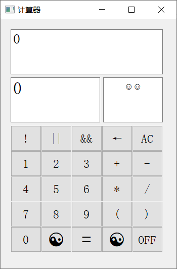
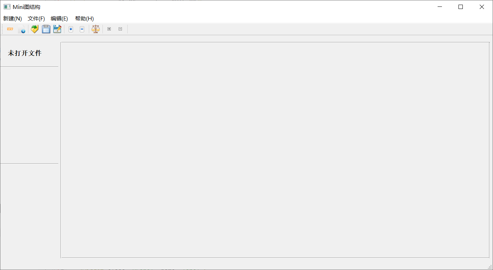
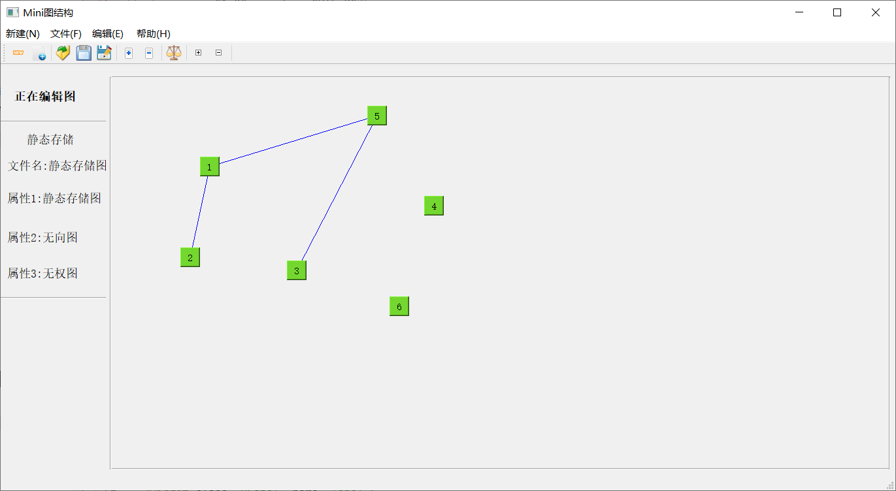

# 数据结构课设

数据结构课设

工具：Qt5

日期：2018年6月

## 项目目录说明

| 文件夹名   | 说明                         |
| ---------- | ---------------------------- |
| QCaculator | 题目：计算器设计工程目录     |
| QGraph     | 题目：图的界面层和数据层实现 |

图的数据层与界面层实现
要求： 
1）实现静态与动态存储方式的图类；
2）要求能够从文件读取数据构建图，完成图中节点的插入和删除，并保存到文件中；
实现图的图形用户界面操作。

## 运行图片示例

